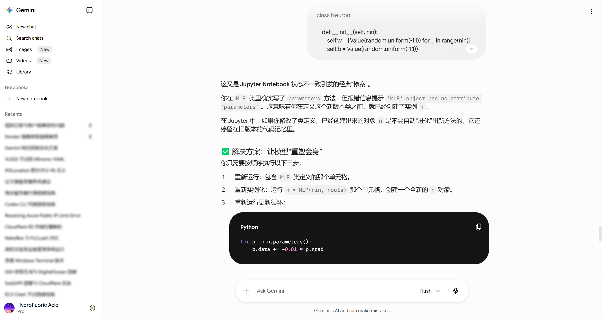
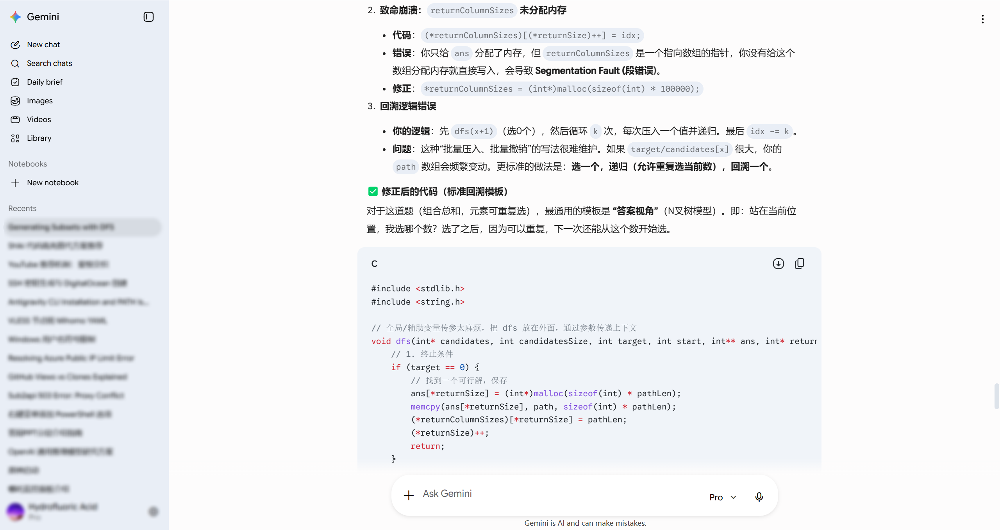
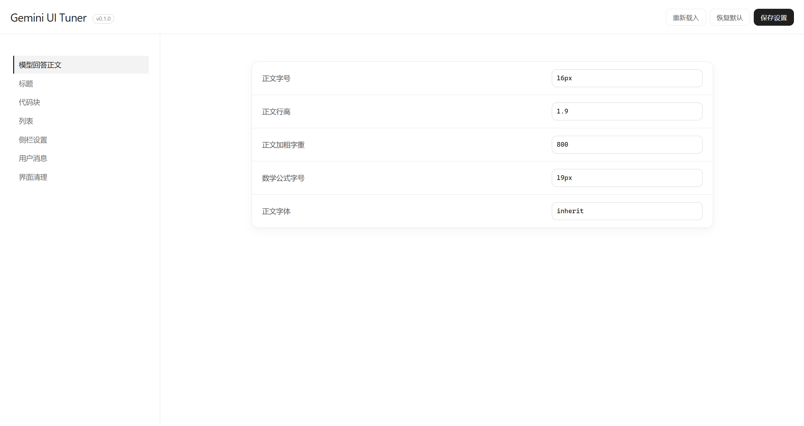

# Gemini UI Tuner

[简体中文](README.md) | [English](README-en.md)

A Gemini UI customization extension that adjusts model answer text, headings, lists, code blocks, side navigation, user message bubbles, and top overlay effects.

## Screenshots
Default style:

  

After enabling the extension:

  
  

Click the extension icon to open settings:

  

## Features

- Adjust answer text and headings, and optimize unordered lists.
- Customize code block styles.
- Customize sidebar background and user message bubble background styles.

## Usage

1. Download the latest archive from [Releases](https://github.com/hydrofluoric07/Gemini-UI-Tuner/releases/latest) and unzip it.
2. Open the Chrome extensions page: `chrome://extensions/`.
3. Enable "Developer mode" in the top-right corner.
4. Click "Load unpacked" and select this extension.
5. Open or refresh `https://gemini.google.com/`.

Click the extension icon in the browser toolbar to open the settings page. Change the style options, then click "Save settings".

If the page does not update immediately, refresh Gemini or reload the extension.

## License

MIT License
